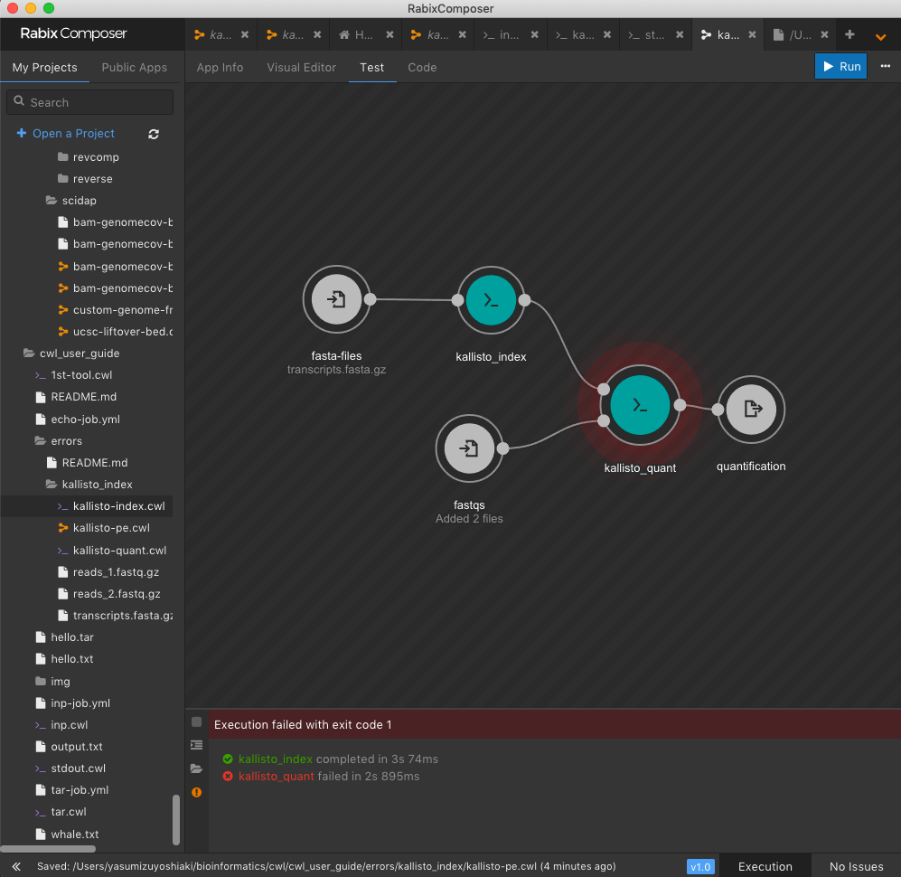

# cwlでつまずいたところ

## 181201 kallisto workflowでindexがうまく引き渡されない

ところで、しつこくkallistoをrabixでやっているのですが、tool単体ではテストはうまく行ったのですが、新しいワークフローを作るとindexがうまくkallisto_quant_singleに渡されません。なにか工夫がいるのでしょうか？

使用したファイルはすべて[https://github.com/yyoshiaki/cwl_user_guide/tree/master/errors/kallisto_index](https://github.com/yyoshiaki/cwl_user_guide/tree/master/errors/kallisto_index) にまとめてあります。特におかしいワークフローは[kallisto-pe.cwl](https://github.com/yyoshiaki/cwl_user_guide/tree/master/errors/kallisto_index/kallisto-pe.cwl) です。



```
[2018-12-01 01:11:51.378] [INFO] Trying to find cached results in the directory rabix-cache/root/.kallisto_quant.meta
[2018-12-01 01:11:51.378] [INFO] Cache directory doesn't exist. Directory rabix-cache/root/.kallisto_quant.meta
[2018-12-01 01:11:51.397] [DEBUG] Collecting outputs for root.kallisto_quant.
[2018-12-01 01:11:51.401] [INFO] Glob service didn't find any files.
[2018-12-01 01:11:51.427] [INFO] Job root.kallisto_quant failed with exit code 1. with message: 
Error: kallisto index file missing


[2018-12-01 01:11:51.429] [DEBUG] Job root.kallisto_quant, rootId: 658fa103-f0e3-46c7-8071-d72cbfe94f50 failed: Job root.kallisto_quant failed with exit code 1. with message: 
Error: kallisto index file missing


[2018-12-01 01:11:51.429] [DEBUG] handleUnusedFiles of 658fa103-f0e3-46c7-8071-d72cbfe94f50: []
[2018-12-01 01:11:51.429] [DEBUG] handleUnusedFilesIfAny(658fa103-f0e3-46c7-8071-d72cbfe94f50)
[2018-12-01 01:11:51.429] [DEBUG] onJobFailed(jobId=b2ce97da-22fd-3dc8-a2ce-0fb68ce361b4)
[2018-12-01 01:11:51.429] [INFO] Composer: {  "message" : "Job root.kallisto_quant failed with exit code 1. with message: \nError: kallisto index file missing\n\n",  "status" : "FAILED",  "stepId" : "root.kallisto_quant"}
[2018-12-01 01:11:51.432] [DEBUG] Root job 658fa103-f0e3-46c7-8071-d72cbfe94f50 failed. Job root.kallisto_quant failed with exit code 1. with message: 
Error: kallisto index file missing
```